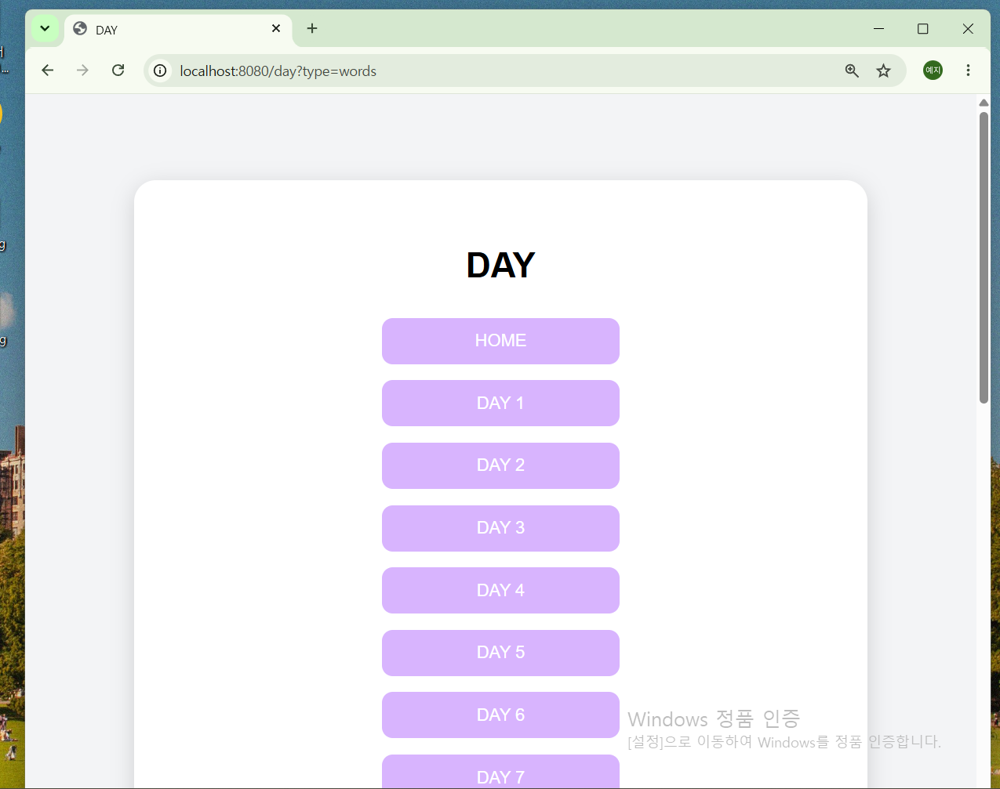
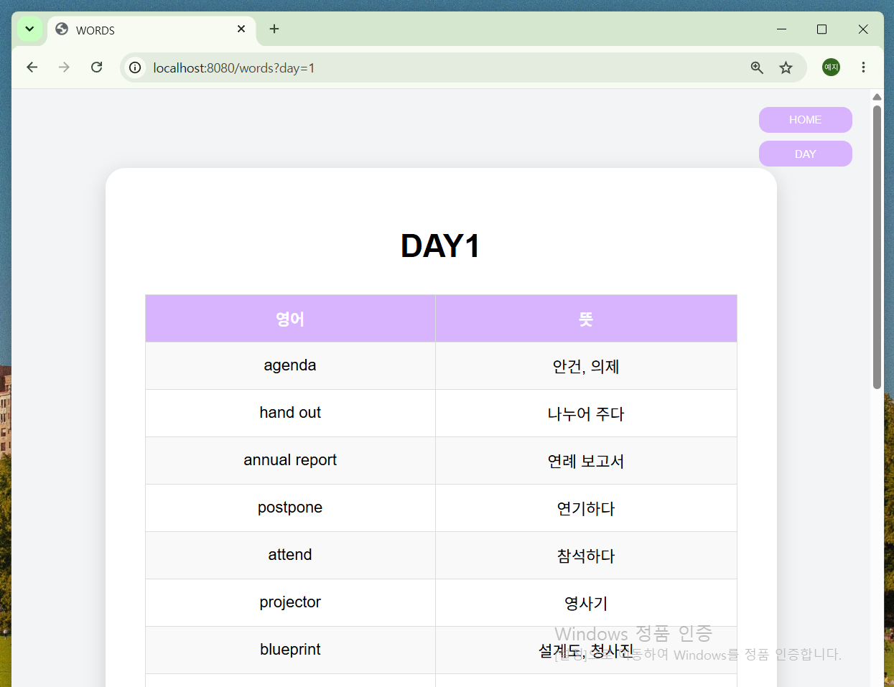
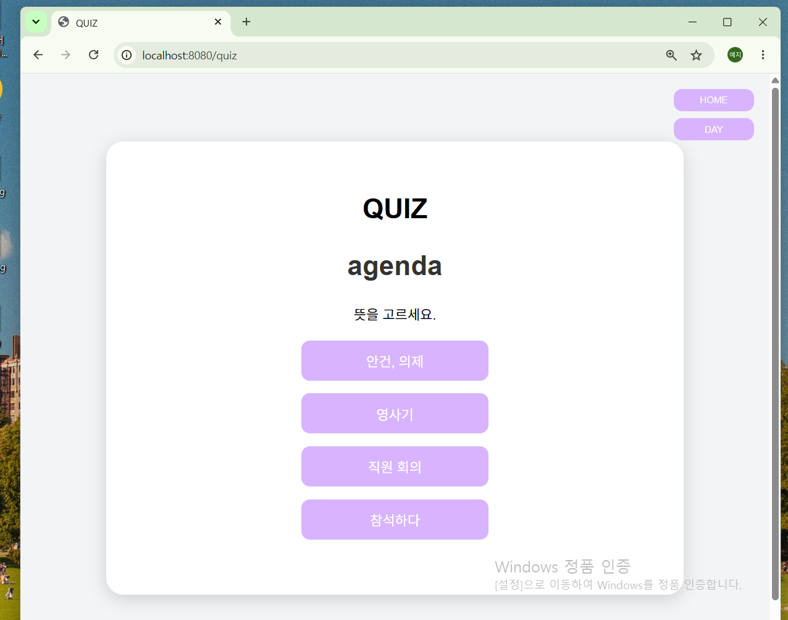
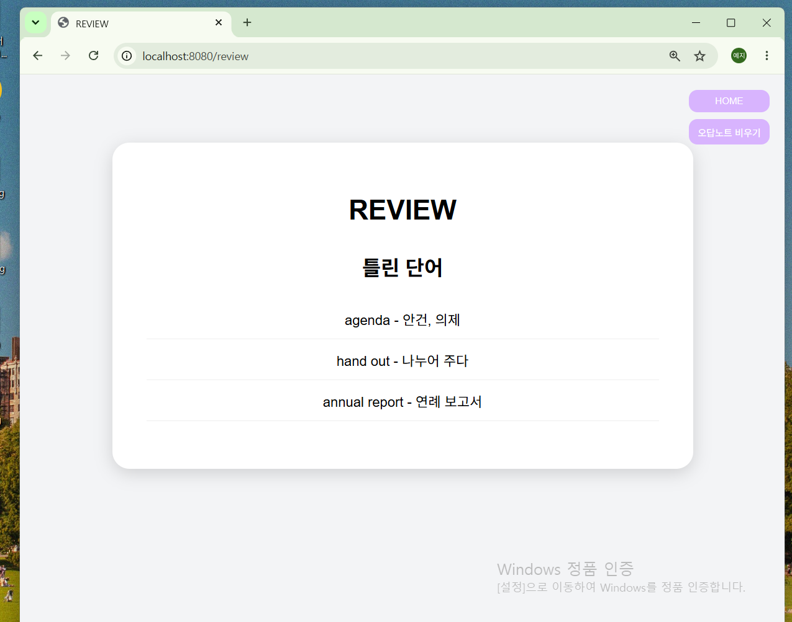

# TOEIC VOCA V1

800+ 토익 보카 암기 웹 애플리케이션 (Spring Boot)

## 프로젝트 소개

토익 단어 암기를 효율적으로 학습하기 위해 개발한 웹 애플리케이션

Day별 단어 조회, 객관식 퀴즈, 오답노트 기능을 제공하며 Spring Boot와 MySQL을 활용

## 사용 기술

- Java 17
- Spring Boot
- MySQL
- Spring Data JPA
- Thymeleaf
- HTML
- CSS
- JavaScript
- Git / GitHub

## 주요 기능

### HOME 화면

### DAY 선택 화면

### 단어 학습 화면

### 퀴즈 화면

### 오답노트 화면

## 기능 설명

### 1. Day별 단어 조회

사용자가 원하는 Day를 선택 시 해당 Day에 저장된 단어 목록 조회

### 2. 객관식 퀴즈

DB에 저장된 단어 데이터를 기반으로 객관식 퀴즈를 제공

### 3. 오답노트

틀린 단어를 오답노트에 저장하여 복습할 수 있도록 구성

### 4. 데이터 관리

MySQL을 사용하여 단어 및 오답 데이터를 관리

## GitHub 공개 시 데이터 처리

저작권 이슈를 고려하여 실제 학습 데이터(단어 데이터)와 원본 PDF 파일은 
GitHub에 포함하지 않았습니다.

공개 저장소에는 프로젝트 소스 코드와 화면 캡처 이미지만 포함했습니다.

## 향후 개선 계획
### Version 2

- 로그인 기능
- 회원가입 기능
- 사용자별 학습 기록 관리
- 사용자별 오답노트 관리
- 점수 기능 개선
