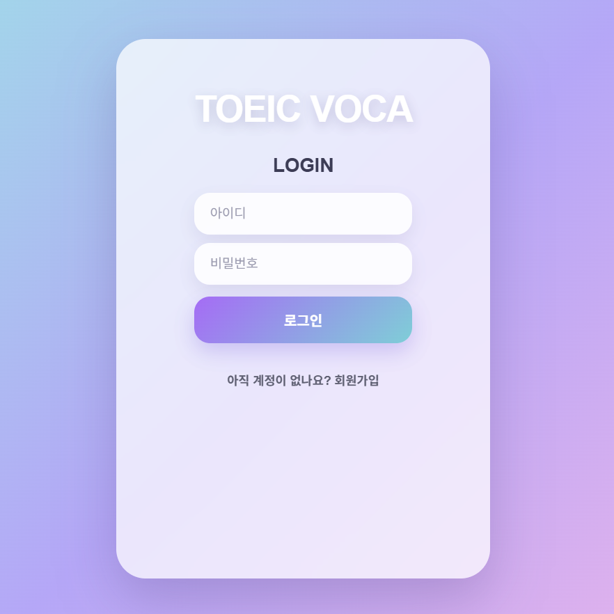
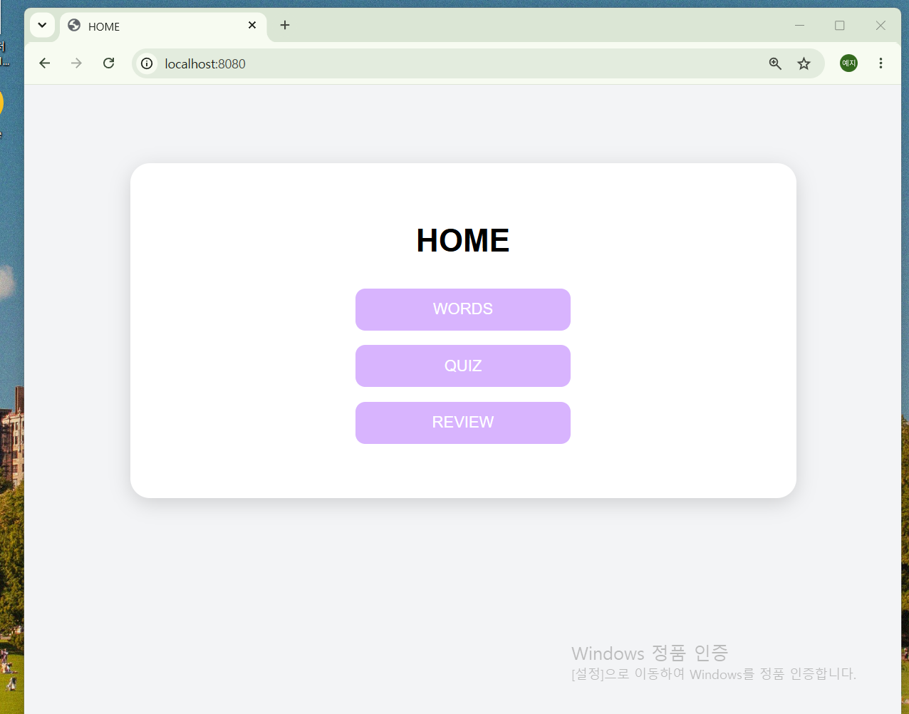

````md
<div align="center">

# 📚 TOEIC VOCA V2

### TOEIC Vocabulary Learning Web Application

> Spring Boot와 MySQL을 활용한 토익 단어 학습 웹 애플리케이션 **[ Ver.2 ]**

<br>


</div>

---

# 📖 Project Overview

기존에 개발한 TOEIC VOCA V1을 확장하여 사용자 인증 및 학습 관리 기능을 추가한 Version 2입니다.

회원가입과 로그인 기능을 통해 사용자별 학습 환경을 제공하며, 오답노트와 학습기록(최고 점수)을 저장하여 반복 학습이 가능하도록 구현하였습니다.

Railway를 통해 배포하였으며, 아래 URL에서 직접 사용해볼 수 있습니다.

🔗 **Demo :** (배포 URL 입력)
toeicvocav2-production.up.railway.app
---

# ✨ Features

| 기능 | 설명 |
|------|------|
| 👤 회원가입 | 사용자 계정 생성 |
| 🔐 로그인 / 로그아웃 | Session 기반 사용자 인증 |
| 📅 Day 선택 | Day별 단어 학습 |
| 📖 Words | 선택한 Day 단어 조회 |
| 📝 Quiz | 객관식 단어 퀴즈 |
| 📒 Review | 사용자별 오답노트 |
| 🏆 Study Record | Day별 최고 점수 저장 |
| 💾 MySQL | 사용자 및 단어 데이터 관리 |

---

# 🛠 Tech Stack

| Category | Technology |
|-----------|------------|
| Backend | Java 17, Spring Boot |
| Database | MySQL |
| ORM | Spring Data JPA |
| Template Engine | Thymeleaf |
| Frontend | HTML, CSS, JavaScript |
| Deployment | Railway |
| Version Control | Git, GitHub |
| IDE | IntelliJ IDEA |

---

# 📷 Screen

<table>
<tr>
<td align="center">
<b>LOGIN</b><br>

</td>

<td align="center">
<b>HOME</b><br>

</td>
</tr>
</table>

---

# 🔄 Application Flow

```text
LOGIN
   │
   ▼
HOME
   │
   ▼
DAY Selection
   │
   ├────────► WORDS
   │
   ├────────► QUIZ
   │              │
   │              ▼
   │      Wrong Answer Save
   │
   ├────────► REVIEW
   │
   └────────► STUDY RECORD
```

---

# 💾 Database

| Table | Description |
|--------|-------------|
| users | 회원 정보 |
| words | 토익 단어 데이터 |
| wrong_words | 사용자별 오답노트 데이터 |
| quiz_score | 사용자별 학습기록 및 최고 점수 |

---

# 🔐 Authentication

- Session 기반 로그인
- 로그인 사용자만 학습 페이지 접근 가능
- 로그아웃 시 Session 종료
- 사용자별 오답노트 관리
- 사용자별 학습기록 저장

---

# ⚠ Copyright

저작권 이슈를 고려하여 샘플 데이터를 재구성하여 제작하였습니다.
(해커스 보카 참고)

---
````
